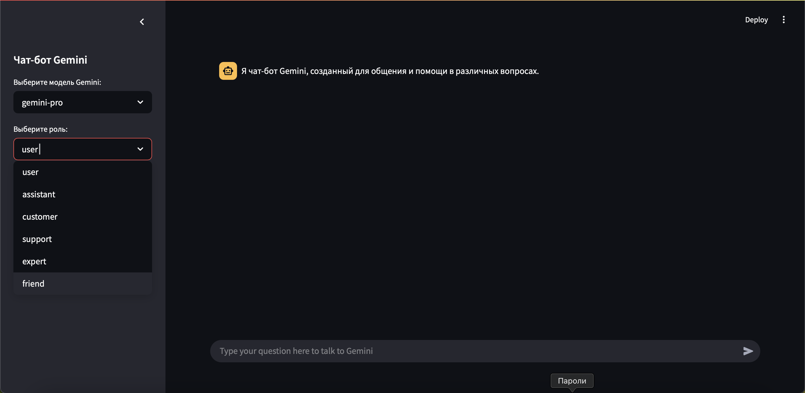

# 🤖 Чат-бот на Gemini с использованием Streamlit и NGROK

Веб-приложение чат-бота, построенное на **Google Gemini API**, **Streamlit** и **NGROK** для безопасного публичного доступа к локальному серверу.

---

## 📌 Возможности

- ✅ Интеграция с Gemini API (генеративный ИИ от Google)
- ✅ Поддержка ролевого поведения (ассистент, друг, эксперт, техподдержка и др.)
- ✅ Публичный доступ через NGROK

---

## 🚀 Как запустить

### 1. Клонируйте репозиторий

### 2. Установите зависимости
```bash
pip install -r requirements.txt
```

### 3. Получите API-ключ Gemini
1. Перейдите на https://aistudio.google.com/prompts/new_chat
2. Сгенерируйте и скопируйте API-ключ

### 4. Создать в корне каталога файл config.py
- Добавить в него ваш API TOKEN GOOGLE
```python
GEMINI_TOKEN = 'YOUR_GEMINI_API_TOKEN'
```
### 5. Установите и настройте NGROK

1. Скачать NGROK:
https://ngrok.com/download
2. Авторизоваться:
```bash
ngrok config add-authtoken ВАШ_NGROK_ТОКЕН
```
### 6. Запустите приложение

```bash
streamlit run main.py
```
### 📷 Интерфейс


### 🎭 Примеры ролей 
| Роль | Описание |
| ------------- | ------------- |
| user | Нейтральный ответ |
| assistant | Стандартное поведение ассистента |
| friend | Дружелюбный и непринуждённый стиль |
| expert | Профессиональные, глубокие ответы |
| support | Стиль технической поддержки |
| customer | Поведение конечного пользователя |

### ⚠️ Примечания

- История чата сбросится при обновлении страницы
- Следите за лимитом токенов Gemini API (особенно при длинных диалогах)
- Не размещайте API-ключи в публичных репозиториях или фронтенде
- NGROK-сессии временные — ссылка меняется при каждом запуске (если вы не используете платный тариф)